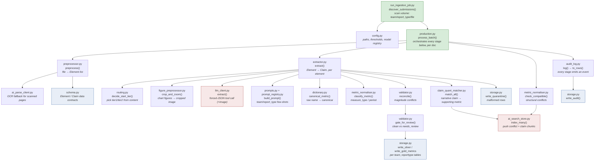

# Module flow — how each `.py` chains in execution order

This is the **module-level** map you asked for: box by box, which script runs
after which, traced from the actual code in `run_ingestion_job.py` and
`production.py` (not an idealised guess). Read it left-to-right / top-to-bottom
the way you'd read the Jobs graph.

## The main line (one document's journey)



## The same thing as a plain sequence (if the diagram doesn't render)

1. **`run_ingestion_job.py` → `discover_submissions()`** — walks the volume
   `<team>/<report_type>/<file>`, resolves `entity_ref` from the filename, hands
   a list of submissions to the orchestrator. Reads **`config.py`** for the
   volume root and settings.

2. **`production.py` → `process_batch()`** — the orchestrator. For each
   submission it runs the stages below in this exact order:

   a. **`preprocessor.py` → `preprocess()`** — turns the file into `Element`
      objects (text / table / figure). Falls back to **`ai_parse_client.py`**
      (OCR) for scanned pages. Produces the **`schema.py` `Element`** contract.

   b. **`extractor.py` → `extract()`** — per element, produces `Claim`s. Inside
      one element it calls, in order:
      - **`routing.py` → `decide_start_tier()`** — tier1 vs tier2 from content;
      - **`figure_preprocessor.py` → `crop_and_zoom()`** — only for chart
        figures, to feed a legible image to the model;
      - **`prompts.py` / `prompt_registry.py` → `build_prompt()`** — the
        team+report_type few-shots;
      - **`llm_client.py` → `extract()`** — the forced-JSON (optionally
        multimodal) model call;
      - **`dictionary.py` → `canonical_metric()`** — raw field name → canonical;
      - **`metric_normaliser.py` → `classify_metric()`** — measure_type/period.
      Malformed rows go to **`storage.py` → `write_quarantine()`**.

   c. **`claim_quant_matcher.py` → `match_all()`** *(optional)* — links each
      narrative claim to the metric that supports it.

   d. **`validator.py` → `reconcile()`** then **`gate_for_review()`** —
      magnitude conflicts, then split claims into clean vs needs-review.

   e. **`storage.py` → `write_silver()` / `write_gold_metrics()`** — writes to
      the per-`team_reporttype` tables (`silver.fx_exchange_report`, …); clean
      claims reach Gold.

   f. **`metric_normaliser.py` → `check_compatible()`** → **`ai_search_store.py`
      → `index_many()`** — structural conflicts (and resolved claim links)
      become searchable chunks in Azure AI Search.

3. **`audit_log.py`** runs *throughout* — every stage emits an event; at the
   end **`storage.py` → `write_audit()`** persists the trail.

## How this maps onto the 3-box Jobs graph

The Jobs graph (WORKFLOW_GUIDE.md) is the same flow at a coarser grain:

- `ingest_documents`  = steps **1–2e** above (discover → … → write Gold).
- `index_to_search`   = step **2f** (the `ai_search_store` push), pulled into
  its own task so it re-runs independently.
- `run_health_check`  = reads the audit / run summary from step **3**.

So the module map and the task graph are two zoom levels of one pipeline: the
diagram shows *how the code fits together*; the Jobs graph shows *what re-runs
as a unit*.

## Uploaded module → where it lives now

The uploaded codebase (40 modules) was mined for techniques on our substrate
(Azure AI Search + GPT-5-mini→Sonnet), not adopted wholesale. This table maps
each uploaded module to where its capability now lives — **adopted** (ported),
**mapped** (same idea, different home/name), or **skipped** (deliberately not
taken, with why).

| Uploaded module | Status | Where it is now / why not |
|---|---|---|
| `run_ingestion_job.py` | mapped | `custom/run_ingestion_job.py` — 3-level `<team>/<report_type>` discovery |
| `pipeline.py` | mapped | `custom/production.py` `process_batch()` (orchestrator) |
| `preprocessor.py` | adopted | `custom/preprocessor.py` (+`custom/ai_parse_client.py` OCR fallback) |
| `bronze_ingest.py` | mapped | folded into `custom/preprocessor.py` parser dispatch |
| `complexity_router.py` | mapped | `shared/routing.py` `decide_start_tier()` |
| `extractor.py` | adopted | `custom/extractor.py` (cascade retargeted to tier1/tier2) |
| `llm_client.py` | adopted | `shared/llm_client.py` (+ multimodal image path) |
| `figure_preprocessor.py` | adopted | `search/figure_preprocessor.py` (crop-and-zoom, now with a working provider) |
| `bbox_viewer.py` | mapped | reviewer bbox render concept; page render via `figure_preprocessor` |
| `dictionary.py` | adopted | `shared/dictionary.py` |
| `metric_normaliser.py` | adopted | `shared/metric_normaliser.py` (measure_type/period + compatibility) |
| `claim_quant_matcher.py` | adopted | `custom/claim_quant_matcher.py` |
| `validator.py` | adopted | `custom/validator.py` (per-metric thresholds) |
| `silver_transform.py` | mapped | merge/idempotency logic in `custom/storage.py` + `production.py` |
| `storage.py` | mapped | `custom/storage.py` — per-`team_reporttype` tables |
| `schema.py` / `schema_registry.py` | mapped | `shared/schema.py` (Claim/Element, CitationTier, ReviewTier) |
| `prompts.py` | adopted | `shared/prompts.py` |
| `prompt_registry.py` | adopted | `shared/prompt_registry.py` (team/report_type few-shots) |
| `llm_router.py` | adopted | `shared/llm_router.py` (SQL/narrative/both + registry synthesis) |
| `sql_query_tool.py` | mapped | SELECT-guard + NL→SQL inside `shared/llm_router.py` |
| `reviewer.py` / `human_review_queue.py` | mapped | `custom/reviewer.py` (`apply_decision` → Gold promotion) |
| `gates.py` | adopted | `shared/gates.py` (ISO-8601 sign-off / 2nd-line validation) |
| `audit_log.py` | adopted | `shared/audit_log.py` (`to_rows()` persistence) |
| `cost_tracker.py` | adopted | `shared/cost_tracker.py` (cascade projection w/ hard_share) |
| `monitoring.py` / `monitoring_app.py` | adopted | `shared/monitoring.py` + `apps/monitoring_app.py` |
| `app.py` / `supervisor_app.py` | mapped | `apps/analyst_app.py` + `apps/supervisor_app.py` |
| `supervisor_memory_logging.py` | mapped | audit/session logging via `shared/audit_log.py` |
| `team_standardiser.py` | skipped | 2nd team-specific Gold view — not needed yet; add later if required |
| `register_team_config.py` | skipped | one-off onboarding script; superseded by `prompt_registry` self-serve |
| `ai_functions_config.py` | adopted | `native/ai_functions_config.py` (native track) |
| `native_pipeline.py` | adopted | `native/native_pipeline.py` (Lakeflow) |
| `vector_sync.py` | adopted | `native/vector_sync.py` (Delta→AI Search) |
| `vector_store.py` | **skipped** | ChromaDB/Voyage — **replaced** by `search/ai_search_store.py` (Azure AI Search) |
| `config.py` | mapped | `shared/config.py` (no local-disk `PipelineMode`; Azure substrate) |
| `volumes.py` | **skipped as a module** | its volume-scanning role lives in `run_ingestion_job.discover_submissions`; no standalone `volumes.py` |

New in our package with no uploaded equivalent: `search/ai_search_store.py`
(Azure AI Search), `custom/ai_parse_client.py` (OCR fallback),
`shared/routing.py` (content-aware routing as a standalone module),
`custom/workflow_tasks.py` (the Jobs-graph task entry points).

## The supervisor-chat side (separate entry, not part of ingestion)

When a supervisor asks a question, a different, shorter chain runs. It is now
conversational — a per-session store gives it memory, logs every Q&A, and
captures feedback:

```
supervisor_app  →  supervisor_session.py (per-session memory + audit + feedback)
                →  llm_router.py answer(session=...)
                     ├─ resolve_references()       rewrite a follow-up into a
                     │                              self-contained question using
                     │                              memory ("from that figure"
                     │                              → "...the primary metric of 8.2%")
                     ├─ classify()                 (SQL / narrative / both)
                     ├─ generate_sql()  → run_sql  (SQL path, on Gold)
                     ├─ ai_search_store.search()   (narrative path)
                     ├─ prompt_registry.get_prompt(team, report_type, "query")
                     │                     → synthesise from that team's few-shots
                     └─ session.record_turn()      persist the Q&A to the
                                                   supervisor_query_log (audit)

  later:  supervisor_app 👍/👎  →  session.add_feedback()  →  same log
          monitoring.supervisor_feedback_summary()  surfaces it on the dashboard
```

Memory is per session (resets when the session ends); the audit log persists
regardless. The same per-session record serves all three jobs — memory,
audit, and the anchor for feedback.
